# Finnish contact info project
This is a project for the introduction to programming course at Tampere University of Applied Sciences. The aim is to make a program that can read and modify a text file that contains contact information.
## Screencast
Here is a [video overview](https://youtu.be/ADbvT_XcaMM) of the programs user experience, developer perspective, known bugs and a short self-evaluation of the project. 
# Features
The program supports creating, reading, updating and deleting finnish contact info from CSV files using a command line user interface. The information you can store includes a finnish personal ID number, first name, last name, phone number, address and e-mail and each piece of information is validated when it is stored.
# Setup and running the program
## Installation
Download the code, unzip it and navigate to the /src folder in a terminal and use the command `javac ContactsApp.java`. You must have Java JDK 21 or later installed.
Now you can run the program from the /src folder in a terminal using the command `java ContactsApp`.
## Running the program
Upon opening the program, it will import data or open a new CSV-file at the path specified in the code. By default, it is contacts.csv and it can be changed here: 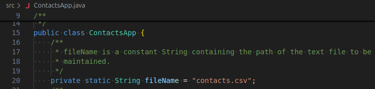
You will then be prompted to give a command and told to type h for help. 
### Help
Typing h and pressing enter will bring up the rest of the commands and their explanations. 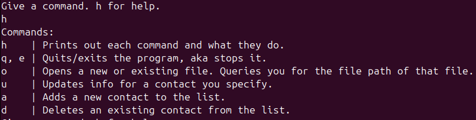
If you decide to add commands to the program they need to be added in two places, an array that holds all the acceptable commands: 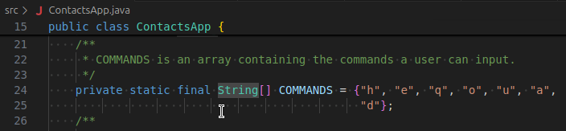
and the help method in ContactsApp: 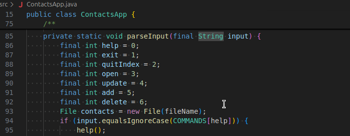
I might implement the commands as objects if I revisit this project later, that way you wouldn't have to hardcode help and the command parser.
### Exit/Quit
Typing q or e and pressing enter, the program will ask you if you want to stop it, if yes you will be asked if you want to overwrite saved data. 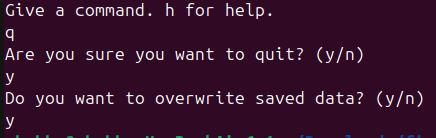 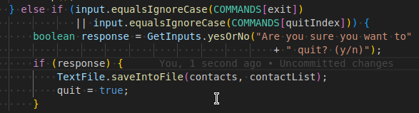
### Open
Typing o and pressing enter, the program will ask you if you want to overwrite the saved data, then ask for the path of the file you want to open. If you give the path to an existing text file, the program will attempt to import the data from that file and display it. If you give a path that doesn't exist a new file will be created, unless the directory doesn't exist either. 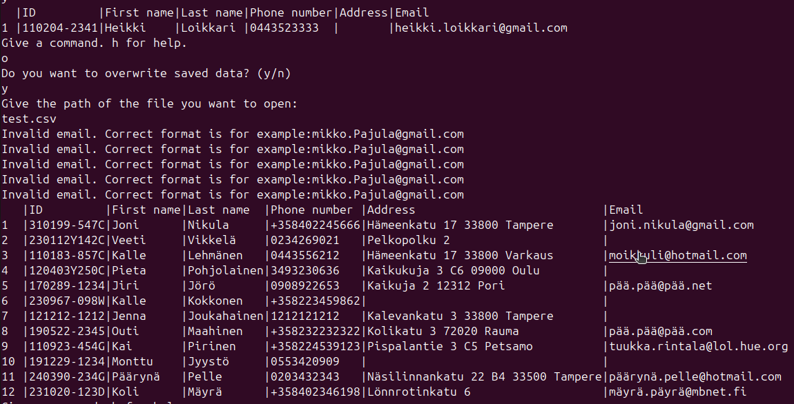  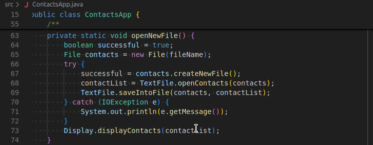
### Update
Typing u and pressing enter, the program will ask you for the index of the contact you wish to update. Afterwards you will be asked what type of information you want to update, or if you want to update all of it. You will then be asked to input the specified type of information to replace the current information, and your input will not be accepted if not valid: 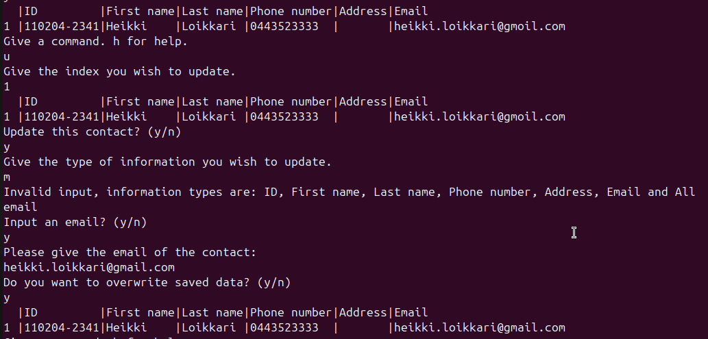 
Afterwards you will be asked if you want to overwrite the saved data.
### Add
Typing a and pressing enter, the program will ask you for the contact information for a new contact. Each
piece of information will be asked and validated separately: 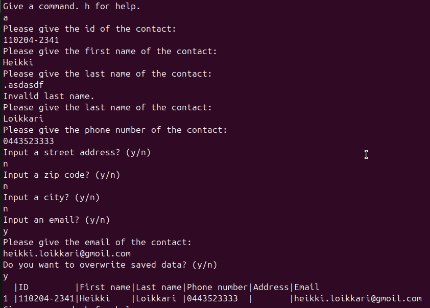 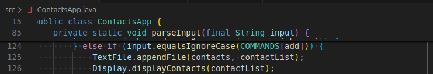
Afterwards you will be asked if you want to overwrite the saved data.
### Delete
Typing d and pressing enter, the program will ask you for an index. After a valid index is provided, that contact information will be printed out and you will be asked if you want to delete it: 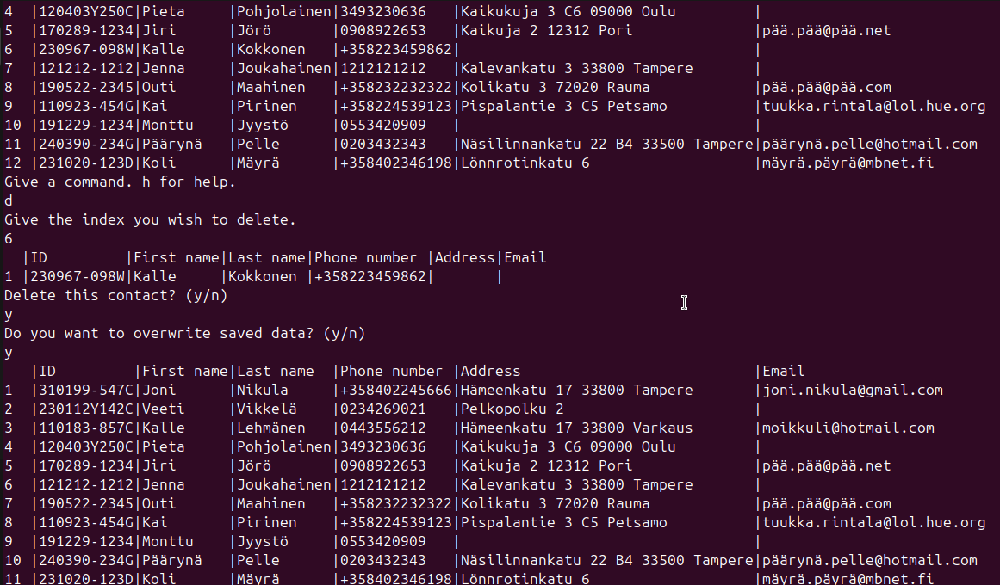 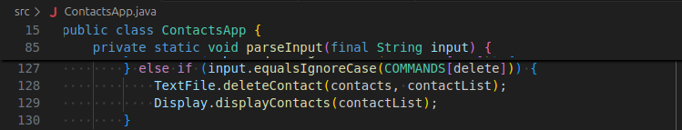
Afterwards you will be asked if you want to overwrite the saved data.
# Code style
I am using the Sun Code Convention for Java.
# Credits
Most of the regular expressions are modified of regular expressions from ihateregex.com and regex101.com.